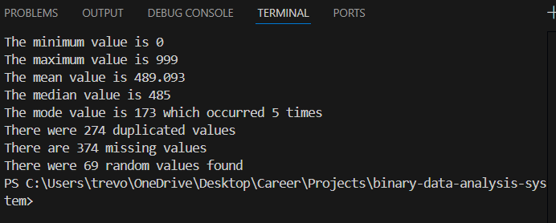

# Binary Data Analysis Engine

## Overview
The **Binary Data Analysis System** is a C++ system designed to generate, store, and analyze large datasets using efficient binary file I/O. This project emphasizes object-oriented design, algorithmic analysis, and low-level data handling to process structured binary data at scale.

The system generates a dataset of integers, writes the data to a binary file, reads it back into memory, and performs multiple analyses including statistical evaluation, duplicate detection, missing value identification, and search performance testing.

---

## Features
- Efficient **binary file generation and parsing**
- Object-oriented architecture using **encapsulation, inheritance, and polymorphism**
- Modular analysis components for extensibility
- Algorithmic data processing including **sorting and searching**
- Statistical analysis of large integer datasets

---

## Technologies Used
- **Language:** C++
- **Concepts:**  
  - Binary file I/O  
  - Dynamic memory management  
  - Object-Oriented Programming (OOP)  
  - Algorithmic analysis (sorting, searching)  
- **Standard Libraries:** `<fstream>`, `<sstream>`, `<cstdlib>`, `<ctime>`

---

## System Architecture
The project is structured around a modular analyzer framework:

- **Binary File Generator**
  - Generates random integer datasets
  - Stores data efficiently in binary format

- **BinaryReader**
  - Reads binary data into memory
  - Handles dynamic allocation and cleanup

- **Analyzer (Abstract Base Class)**
  - Defines a common interface for analysis modules
  - Enables polymorphic behavior

- **Derived Analyzer Classes**
  - `StatisticsAnalyzer` – Computes min, max, mean, median, and mode  
  - `DuplicateAnalyzer` – Identifies duplicated values  
  - `MissingAnalyzer` – Detects missing values in the expected range  
  - `SearchAnalyzer` – Performs randomized binary search operations  

---

## Algorithms Implemented
- Selection Sort  
- Recursive Binary Search  
- Frequency counting  
- Statistical calculations (mean, median, mode)  

---

## Example Output
The program outputs analysis results directly to the console, including:  
- Minimum and maximum values  
- Mean, median, and mode  
- Number of duplicated values  
- Number of missing values  
- Count of successful search operations  

---

## Learning Outcomes
- Practical use of binary data storage for performance and efficiency
- Strong understanding of object-orietnted software design
- Implementation of core algorithm in a systems programming context
- Safe dynamic memory handling in C++